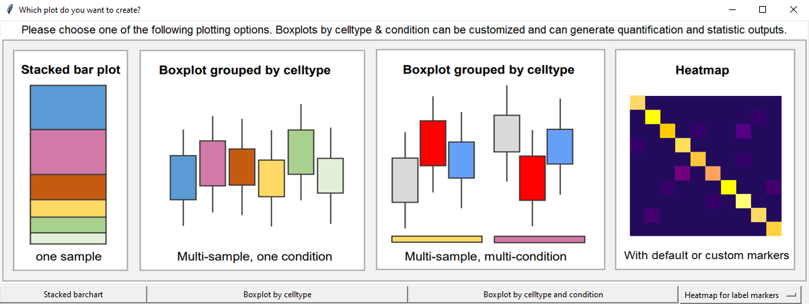

# Usage Guide
#### A standard workflow to annotate a simple CSF dataset

## 1. What is annotateCSF?
AnnotateCSF is a tool for annotation of scRNAseq datasets that contain CSF immune cells and wraps a user interface around scanpy, scVI, and scANVI workflows. You can also perform downstream analyses such as differential composition and -expression analysis.

## 2. Installation / Starting the software

Our software is provided for Windows 10 and for Linux as a portable package. This package comes with all the required libraries already included and does not require any installation on your computer. In particular, your existing system configuration will not be changed at all.

Please download the provided installation archive for your operating system from the [GitHub release page](https://github.com/uni-ms/annotateCSF/releases/tag/1.0), unzip it into a folder of your choice, and run the `run_aCSF` executable.

### Alternatively:
If you want to run the software on a different operating system (e.g. MacOS), or customize the source code, then you need a Python 3.9 installation with some packages on your PC.

For this purpose, a startup script is provided which, when used for the first time, ensures that a virtual Python environment is set up, all required packages are downloaded and installed, and annotateCSF is started.

When first used, it will take up to 15 minutes to make the necessary preparations and run the program.

The start script will also make sure that the required sample dataset is downloaded for you.

Please clone the Git repository with `git clone https://github.com/uni-ms/annotateCSF.git` and use the following startup script to run annotateCSF:
| 		| Start annotateCSF	| Build installer package	|
|---------------|-----------------------|-------------------------------|
| Windows	| `start.cmd`		| `start.cmd -create`		|
| Linux		| `bash start.sh`	| `bash -c "start.sh -create"`	|
| Mac OS	| `bash start_mac.sh`	| `bash -c "start.sh -create"`	|

### Alternatively:
Additionally, a Docker-based setup is also available, but not recommended. Please see `Docker_usage.txt` for details.

## 3. Testing Dataset
For demonstration purposes, we provide a small test data set that you can use to get acquainted with the program.

Use the data in the folder test_data, for your first experiments with annotateCSF.

Please note that you have to download the measurement data `matrix.mtx` in the folder `test_data/10x_csf` from the following source: https://zenodo.org/record/6795112
 
## 4. The GUI

## 5. Providing input data
(1) Click on *"I. a. Choose 10X data"* and select a folder, in which your dataset (consisting of `matrix.mtx`, `features.tsv`/`genes.tsv` and `barcodes.tsv`) resides. You can choose the provided sample folder `10x_csf` in `test_data`.

(2) Click on *"II. a. Choose condition.tsv"* and select a tsv-file, providing the relevant test condition for each sequence. You can just choose our sample file `condition.csv` in `test_data`. In our sample, it is MS (Multiple Sclerosis) vs HD (healthy donor). The file shall have the following format:
| X			|	|
|-----------------------|-------|
| AAACCTGAGCATGGCA-1_2	| HD	|
| AAACGGGAGGTTACCT-1_2	| HD	|
| TTTGTCATCAGATAAG-1_22	| MS	|
| TTTGTCATCGGAGGTA-1_22	| MS	|

(3) (optional) In case, you have more than one study, click on *"II. b. Choose study.tsv"* and select a tsv-file, providing a study identifier for each sequence. The file shall have the following format:
| X	 |
|--------|
| study1 |
| study1 |
| study1 |
| study1 |

(4) Click on *"II. c. Choose idents.tsv"* and select a tsv-file containing a sample identifier for each sequence. Of course, you can again chose the provided sample file. The file shall have the following format:
| X			|			 |
|-----------------------|------------------------|
| AAACCTGAGCATGGCA-1_2	| HA5876_HD1_CSF_RNA.csv |
| AAACGGGAGGTTACCT-1_2	| HA5876_HD1_CSF_RNA.csv |
| TTTGTCATCAGATAAG-1_22	| MS1131_MS5_CSF_RNA.csv |
| TTTGTCATCGGAGGTA-1_22	| MS1131_MS5_CSF_RNA.csv |

## 6. Run Calculation
When you have selected all necessary files, please click on *"III. Run mapping"*.
This process may take a while for a rough analysis of the provided dataset.
 

After this, you will be provided with an overview plot and a window for selecting the desired thresholds. For a first approach, you can just keep the proposed threshold values. Click on *"Apply thresholds"* to apply the threshold values and close the overview plots window to continue with the mapping process.

(**Caution:** The threshold selection window may open behind the overview plots on some systems and/or the *"Apply thresholds"* button may be out of the window’s borders. Please adjust the window’s size in this case.)

After confirmation of the thresholds, the mapping process will be performed. This may take some hours. Please be patient. You can watch the current progress in the console window.
 
## 7. Interpretation of the output
After the mapping process has completed, you can generate a lot of plots.

A good point to start would be:
1. **UMAP predictions:**

   Click on *"IV. a. Plot UMAP"* and select *"Do not subset"*.
   You will be asked, for which gene you want to create a plot. Enter a gene name or *"predictions"* for generating a plot.
2. **Quantification plot:**

   Click on *"IV. b. Plot quantifications"* and select *"Do not subset"*.
   You will see another window, which allows you to choose from several plots:

 
Click on *"Box plot by celltype and condition"* for a quantifications box plot.

Several other plots will be available. Please feel free to experiment with all the various configuration options!

If you feel, some plots are missing or have some ideas to improve the software, please let us know!
