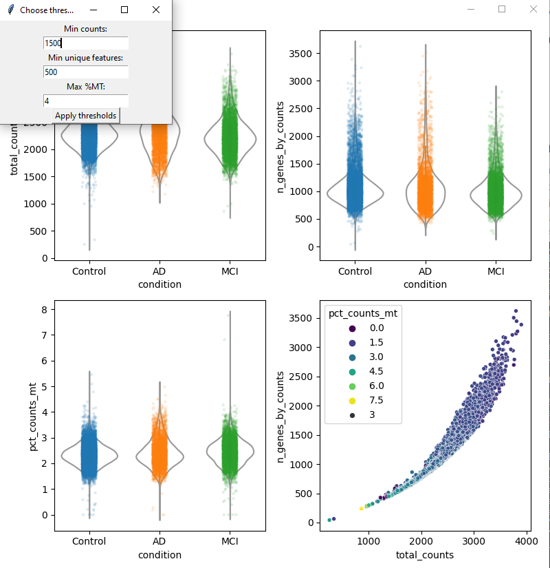

# Usage Guide
#### A standard workflow to annotate a scRNAseq CSF dataset

## 1. What is annotateCSF?
annotateCSF or aCSF is a tool for annotation of scRNAseq datasets that contain cerebrospinal fluid (CSF) immune cells and wraps a user interface around a context-optimized workflow for scanpy (Wolf et al., 2018), scVI-tools (Lopez et al., 2018; Gayoso et al., 2022), and scANVI (Xu et al., 2021). The dataset that is used as a reference was compiled using several published CSF scRNAseq datasets and is described in detail in Ostkamp et al., Sci Transl Med (2022). It is also possible to conduct downstream exploration and analysis with UMAP plots, differential gene and -abundance analysis and so on. The aim of aCSF is to assist researchers with the analysis of their own datasets and to provide a reference atlas that is specifically suited for the annotation of CSF leukocytes unlike atlases based on peripheral blood that do not correctly reflect leukocyte heterogeneity of CSF.

## 2. Installation / Starting the software

Our software is provided for Windows 10 and for Linux as a portable package. This package comes with all the required libraries already included and does not require any installation on your computer. In particular, your existing system configuration will not be changed at all.

The portable package should be usable on most standard systems. However it may not (fully) work with every system configuration. In case, you experience some error, please try running annotateCSF via the "manual way" (see paragraph 3).

Please download the provided installation archive for your operating system from our Online Storage ([v1.0](https://uni-muenster.sciebo.de/s/X3BC6vNhuzEun6i?path=%2FannotateCSF_release)), unzip it with [7zip](https://www.7-zip.org/download.html) into a folder of your choice, and run the `run_aCSF` executable.

Under Linux, we recommend to start `./run_aCSF` from a terminal rather than from your file browser, because otherwise you may not see annotateCSF's console output (status, error messages, etc).

## 3. The manual way (alternative)
If you want to run the software on a different operating system (e.g. macOS), or customize the source code, then you need a Python 3.9 installation with some packages on your system.

For this purpose, a startup script is provided which, when used for the first time, ensures that a virtual Python environment is set up, all required packages are downloaded and installed, and annotateCSF is started.

When first used, it will take up to 15 minutes to make the necessary preparations and run the program.

The startup script will also make sure that the required sample dataset is downloaded for you.

Please install Python 3.9 and pip via your system's packet manager, or download and run the [Python installer](https://www.python.org/ftp/python/3.9.13/python-3.9.13-amd64.exe) for Windows.

(On Windows: [Visual C++ Build Tools](https://go.microsoft.com/fwlink/?LinkId=691126) may be required. On macOS: [Homebrew](https://brew.sh/) may be required. On Linux: apt-get may be needed, or you may need to adapt `start.sh`.
In case, the installation of dependencies fails, please install the above components. Then entirely delete the subfolder `env` and run the startup script again.)

Then, clone the Git repository with `git clone https://github.com/uni-ms/annotateCSF.git` and use the following startup script to run annotateCSF:
| 		| Start annotateCSF	| Build installer package		|
|---------------|-----------------------|---------------------------------------|
| Windows	| `start.cmd`		| `start.cmd -create`			|
| Linux		| `bash start.sh`	| `bash -c "start.sh -create"`		|
| Mac OS	| `bash start_mac.sh`	| `bash -c "start_mac.sh -create"`	|

### Alternatively:
Additionally, a Docker-based setup is also available, but not recommended. Please see [Docker_usage.txt](Docker_usage.txt) for details.

## 4. Testing Dataset
For demonstration purposes, we provide a test dataset (from Gate et al., Science, 2021) that you can use to get acquainted with the software. 

Use the data in the folder [test_data](test_data), for your first experiments with annotateCSF.

Please note that you have to download the measurement data `matrix.mtx` in the folder `test_data/10x_csf` from the following source: https://zenodo.org/record/6913704
(This will be done by the startup script.)
 
## 5. The GUI
The GUI has been designed to allow for an easy, linear and structured workflow.
The main window also serves a quick start tutorial, and provides most information that is needed to run the tool.
Pressing certain buttons will open sub windows to allow for more choices for e. g. plotting.


## 6. Providing input data
The tool requires the data to be in the 10X format, i.e. it requires a matrix.mtx, barcodes.tsv and features.tsv (or genes.tsv from older cellranger versions). This format is the most widely used format and other formats can typically be transferred to the 10X format.

(1) Click on *"I. a. Choose 10X data"* and select a folder, in which your dataset (consisting of `matrix.mtx`, `features.tsv`/`genes.tsv` and `barcodes.tsv`) resides.
This data is typically obtained from running the CellRanger software on raw fastq-files. If you are working from a Seurat object in R, data in 10X format can easily be written to your disk using the DropletUtils library and subsequently be read into aCSF:
```
DropletUtils::write10xCounts("/path/10x_files", seurat_object@assays$RNA@counts)
```

As a start, you can choose the provided sample folder [10x_csf](test_data/10x_csf) in [test_data](test_data).

(2) Click on *"II. a. Choose condition.tsv"* and select a tsv-file, providing the relevant test condition for each sequence.
You can just choose the sample file [condition_csf.csv](test_data/condition_csf.tsv) in [test_data](test_data). The dataset consists of control-, PD (Parkinson's disease)- and LBD (Lewy body dementia) CSF samples.

Metadata .tsv files for e.g. medical condition can also be exported from a Seurat object in R by typing:
`write.table(seurat_object$condition, "your_condition.tsv")`.

The file should have the following format:
| X			|	  |
|-----------------------|---------|
| AAACCTGAGCATGGCA-1_2	| Control |
| AAACGGGAGGTTACCT-1_2	| Control |
| TTTGTCATCAGATAAG-1_22	| PD	  |
| TTTGTCATCGGAGGTA-1_22	| PD	  |

(3) (optional) In case, you have data from more than one study, click on *"II. b. Choose study.tsv"* and select a tsv-file, providing a study identifier for each sequence. You can later visualize this in UMAP plots and see whether the data has been well integrated with regard to the different studies.
The file shall have the following format:
| X			|	 |
|-----------------------|--------|
| AAACCTGAGCATGGCA-1_2	| study1 |
| AAACGGGAGGTTACCT-1_2	| study1 |
| TTTGTCATCAGATAAG-1_22	| study1 |
| TTTGTCATCGGAGGTA-1_22	| study1 |

(4) Click on *"II. c. Choose idents.tsv"* and select a tsv-file containing a sample identifier for each sequence.
Of course, you can again chose the provided sample [file](test_data/idents_csf.tsv).
The file shall have the following format:
| X			|	  |
|-----------------------|---------|
| AAACCTGAGCATGGCA-1_2	| Donor_1 |
| AAACGGGAGGTTACCT-1_2	| Donor_1 |
| TTTGTCATCAGATAAG-1_22	| Donor_2 |
| TTTGTCATCGGAGGTA-1_22	| Donor_2 |

## 7. Map labels from reference- to query dataset
When you have selected all necessary files, please click on *"III. Run mapping"*.
This process may take a while.
 


First, you can choose whether you want to perform doublet exclusion using scrubet. If you choose so, this will be performed for each sample individually and you can then enter a meaningful threshold (0.2 - 0.3 is a common choice).  For basic quality control, you can choose to conduct QC for all samples at once or sample by sample. Next, a plot will be shown and you can select the desired QC thresholds for your analysis. Click on *"Apply thresholds"* to apply the threshold values and close the overview plots window to continue with the mapping process.

(**Caution:** The threshold selection window may open behind the overview plots on some systems and/or the *"Apply thresholds"* button may be out of the window’s borders. Please adjust the window’s size in this case.)

After confirmation of the thresholds, the mapping process will be performed. This may take some time and depends on your system. Note that the scVI workflows used in aCSF support CUDA for Nvidia graphic cards which accelerates the process by a lot. Progress bars will be shown in the console window, which will finish to 100% for first two progress bars (pre-training). The third progress bar may run until 100%, but finish earlier: This is intended and is meant to avoid overfitting. 
 
## 8. Visualization, analysis, and interpretation of the output
After the mapping process has completed, you can perform further analyses and visualize your data.

A good point to start would be:
1. **UMAP predictions:**

   Click on *"IV. a. Plot UMAP"* and select *"Do not subset"*.
   A window will open asking for specifications. In the simplest case, you select "predictions" in field I. and press plot. This generates a UMAP plot colored according to the predicted labels. If you want to add more information, e.g. gene expression, you can click the button "Add more info" (II.). Here, choose a gene symbol from the provided list or simply enter one yourself. You can also choose to plot more metadata, e.g. the medical conditions or the study identifier. You always have to make a choice and click confirm after choosing the desired information. Fields III. - VI. help you to customize the plot further, e. g. by selecting palettes or choosing the point size. There are also three further fields that are meant for subsetting your data, in case you only want to view data from a certain sample or a certain condition. Note that you can also generate UMAP plots containing only cells from a chosen lineage, e.g. from CD4 T cells. In this case, you do not click "Do not subset" in the first place, but choose the desired lineage. This option will subset the data accordingly and compute a new UMAP for which also a model will need to be run (integration willl be based on scVI or scanpy). This will take some time again, but usually provides a better view than simply using the UMAP coordinates generated from the main model. Below you can see an example for the kind of visualization that can be achieved:


      

2. **Quantification plot:**

   Click on *"IV. b. Plot quantifications"* and select *"Do not subset"*.
   You will see another window, which allows you to choose from several plots:


 
Click on *"Boxplot by celltype and condition"* for a quantification box plot. You will be asked whether you want to save the quantification results, you can do this if you wish to perform any further analyses on this data. Boxplots by celltype and condition can also be customized and you will be asked whether you want to perform a basic statistical analysis using linear models. The results of this analysis can also be saved as spreadsheets.

Several other plots are also available. Please feel free to experiment with all the various configuration options!

If you feel that some plots are missing or have some ideas to improve the software, please let us know!

2. **Differential expression:**

To check for differentially expressed genes between cell types or between medical conditions, you can perform differential gene expression analysis. Simply choose the desired comparisons, this can also be freely customized using "Custom DGE". DGE analysis will then be performed and you will be asked to provide thresholds for plotting a heatmap.

## 9. Troubleshooting
Under construction...

